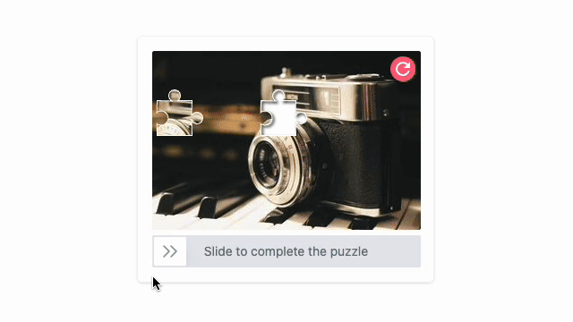

<h1 align="center">KonCaptcha - Sliding Puzzle CAPTCHA</h1>

<div align="center">


Lightweight sliding puzzle CAPTCHA to protect websites from bots.

</div>

## 🖼️ Demo



## 🚀 Features

- Lightweight & Performant
- Accessible and user-friendly
- Framework Agnostic
- Simple to Use
- Fully Customizable
- Zero Runtime Dependencies

## 📦 Installation

```bash
npm i @emravoan/koncaptcha
# or
pnpm add @emravoan/koncaptcha
# or
yarn add @emravoan/koncaptcha
```

## 💡 Example

```js
import konCaptcha from '@emravoan/koncaptcha';

const el = document.getElementById('captcha');
const kci = konCaptcha(el);

kci.onAttempt(result => {
  console.log(`Captcha verified: ${result.verified}`);
});
```

## 📖 Usage

#### HTML

```html
<div id="captcha"></div>
<button id="refresh">Refresh</button>
```

#### JavaScript (ES Modules)

```js
import konCaptcha from '@emravoan/koncaptcha';

const el = document.getElementById('captcha');
const kci = konCaptcha(el);

kci.onAttempt(result => {
  console.log(`Captcha verified: ${result.verified}`);
});

// Optional reset via button
// document.getElementById('refresh').addEventListener('click', () => {
//   kci.reset();
// });
```

#### UMD (Browser)

```html
<script src="https://unpkg.com/@emravoan/koncaptcha"></script>
<script>
  const el = document.getElementById('captcha');
  const kci = window.konCaptcha(el);

  kci.onAttempt(result => {
    console.log(`Captcha verified: ${result.verified}`);
  });

  // Optional reset via button
  // document.getElementById('refresh').addEventListener('click', () => {
  //   kci.reset();
  // });
</script>
```

## 📃 API

```ts
konCaptcha(element: HTMLElement, options?: IKonCaptchaOption): IKonCaptchaInstance
```

#### Options

```ts
interface IKonCaptchaOption {
  width?: number; // Optional. Width of the CAPTCHA container in pixels.
  height?: number; // Optional. Height of the CAPTCHA container in pixels.
  imgSrc?: string; // Optional. URL of the image to use for the CAPTCHA puzzle.
  deviation?: number; // Optional. Allowed deviation for verification (in pixels).
  wrapperClass?: string; // Optional. CSS class to apply to the main CAPTCHA wrapper element.
}
```

#### Instance

```ts
interface IKonCaptchaInstance {
  reset: () => void;
  onAttempt: (cb: (result: IKonCaptchaReturn) => void) => void;
}

interface IKonCaptchaReturn {
  verified: boolean;
}
```

## 🛠️ Development

```bash
git clone https://github.com/emravoan/koncaptcha.git
cd koncaptcha
pnpm install
pnpm build
```

## 📄 License

This project is licensed under the MIT License. See the [LICENSE](./LICENSE) file for details.

## ❤️ Contributing

We welcome contributions! If you have suggestions, bug reports, or want to contribute code, please feel free to open an issue or submit a pull request on the [GitHub repository](https://github.com/emravoan/koncaptcha).

## 📞 Contact

For any questions or feedback, please reach out via the [GitHub Issues](https://github.com/emravoan/koncaptcha/issues) page.
